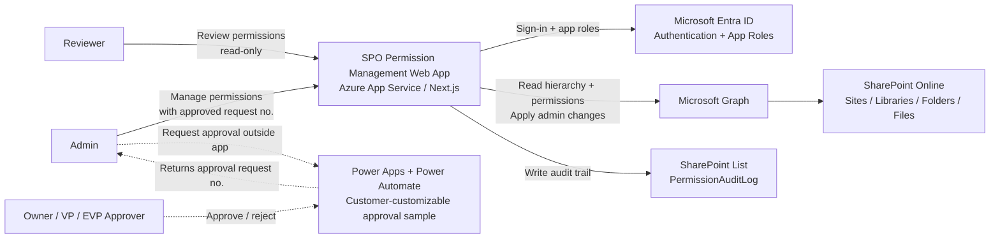
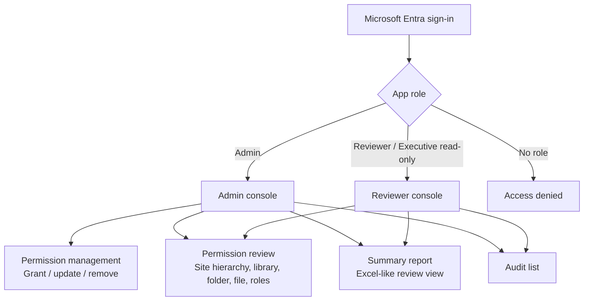
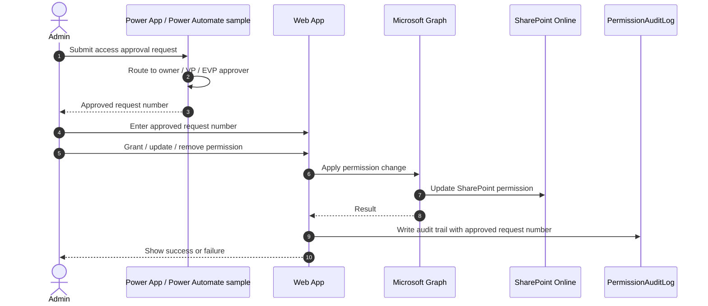
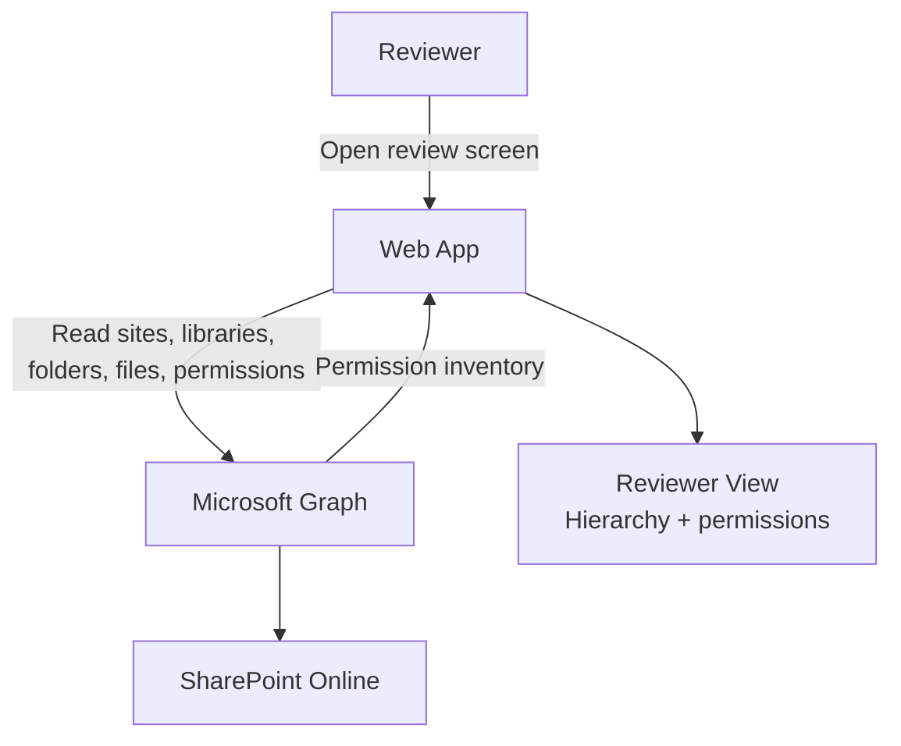
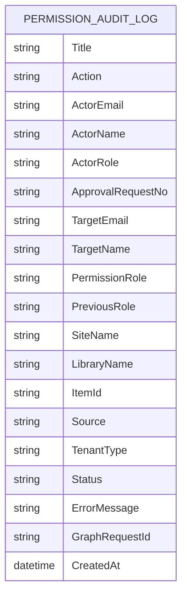

# SharePoint Permission Management Architecture

This document describes the target architecture for the SharePoint Permission Management web app after separating approval workflow ownership from the core web app.

## Scope

The web app is responsible for SharePoint permission review, direct permission changes by authorized admins, and audit trail capture.

Approval workflow is intentionally separate. Power Apps and Power Automate provide a sample approval flow that the customer can customize. The web app records the approved request number when an admin changes permissions, so auditors can reference the external workflow.

## System Context

## Application Screens

## Permission Change Flow

## Reviewer Flow

## Audit Data Model

## Role Responsibilities

| Role | Can change permissions | Can review permission inventory | Can view audit | Notes |
| --- | --- | --- | --- | --- |
| Admin | Yes | Yes | Yes | Must enter approved request number before permission changes. |
| Reviewer | No | Yes | Yes | Read-only review and audit access. |
| ExecutiveUser | No | Yes | Yes | Backward-compatible read-only role that maps to Reviewer behavior. |

## Implementation Impact

The web app should remove core dependencies on approval request processing:

- Remove internal `PermissionAccessRequests` workflow from the main app path.
- Remove backend apply endpoint that exists only for Power Automate HTTP callbacks.
- Keep direct Graph permission changes for Admin, guarded by approved request number input.
- Extend `PermissionAuditLog` with `ApprovalRequestNo`.
- Add a dedicated Audit screen.
- Evolve the Reports screen into a Reviewer-oriented permission inventory.

Power Apps and Power Automate can remain as a separate sample package:

- Requester submits approval.
- Owner / VP / EVP approves.
- The flow returns or records an approved request number.
- Admin references that number in the web app before applying SharePoint permission changes.
